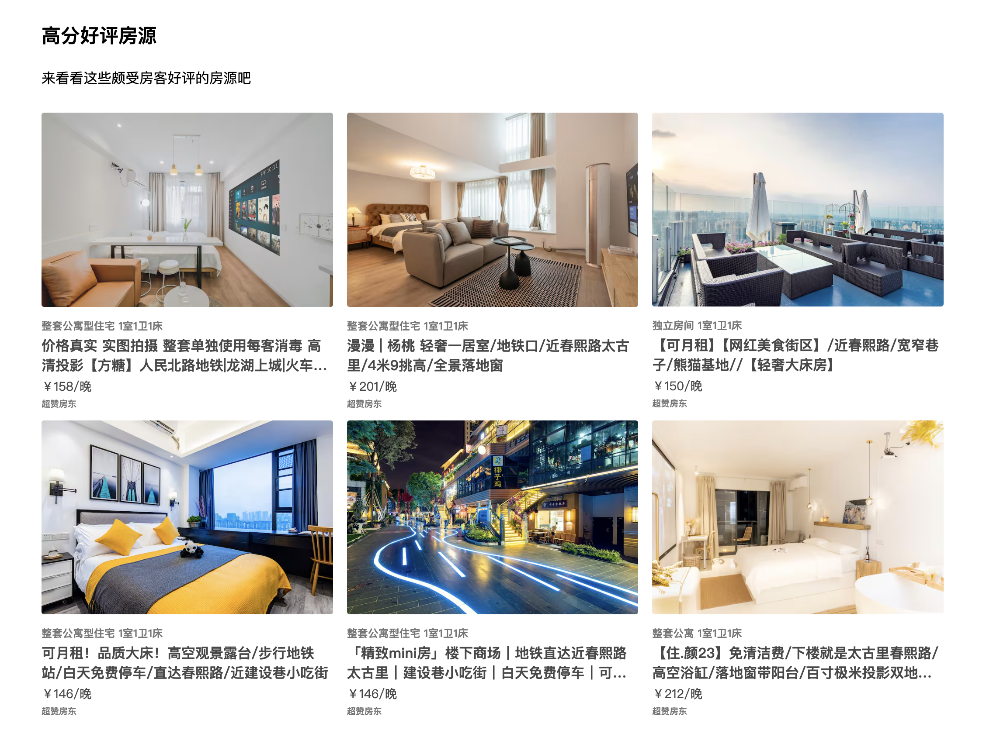

# About
一个使用vite构建的vue3基础语法的Demo,通过该Demo你将学习到父子间通信，less

项目运行
---
```
git clone https://github.com/tianshengluxiaoguo/Vue3Demo.git
npm install 
npm install less-loader -D 
npm run dev 
```
- 数据在data文件夹
- 组件放在了components文件夹内


demo实现图如下
---
